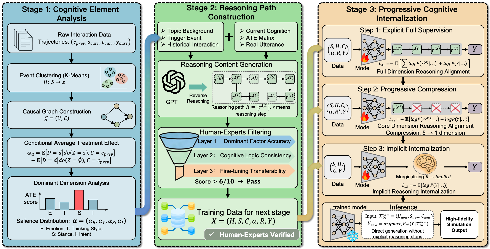

# CoRE

CoRE (Cognition-oriented Response Enhancement) is a cognition-grounded framework for human-like social media response simulation. This repository contains the main CoRE pipeline, released data, inference and evaluation prompts, and the training script for progressive cognitive internalization.

## Framework

<p align="center">
  
</p>

## Overview

CoRE models social reply generation as a cognition-driven process. Instead of generating a response only from the current context, it explicitly organizes the pipeline around cognitive elements such as emotion, thinking style, stance, and intent, then gradually internalizes this reasoning into the model.

This release includes:

- The core CoRE pipeline under `core/`
- The released train/test split under `data/`
- Inference and LLM-evaluation prompts under `prompt/`
- An OpenAI-compatible LLM client under `utils/`

## Repository Structure

```text
CoRE-main/
├── core/
│   ├── stage1/
│   │   ├── step1_event_abstraction.py
│   │   ├── step2_chain_extraction.py
│   │   ├── step3_graph_construction.py
│   │   ├── step4_ate_calculation.py
│   │   └── step5_ate_personalization.py
│   ├── stage2/
│   │   ├── step1_generate_chains.py
│   │   └── step2_generate_train_samples.py
│   └── stage3/
│       └── multi_sft_stages.py
├── data/
│   ├── train_data.json
│   └── test_data.json
├── figs/
│   └── CoRE.png
├── prompt/
│   ├── inference_prompt.txt
│   └── eval_prompt.txt
└── utils/
    └── llm_client.py
```

## Data

The released data files are stored in:

- `data/train_data.json`
- `data/test_data.json`

Each sample contains the social interaction context and annotated cognitive labels used in the CoRE pipeline, including fields such as:

- `original_post`
- `context_post`
- `target_post`
- `user_id`
- `timestep`
- `topic`
- `topic_description`
- `cognitive_labels`

## Prompt Files

Two prompt files are included in this release:

- `prompt/inference_prompt.txt`: prompt template for response generation
- `prompt/eval_prompt.txt`: prompt template for LLM-based evaluation

## Pipeline

### Stage 1: Cognitive Element Analysis

Stage 1 extracts event descriptions, builds interaction chains, constructs the cognitive transition graph, estimates ATE-style scores, and performs sample-level personalization.

Main scripts:

- `core/stage1/step1_event_abstraction.py`
- `core/stage1/step2_chain_extraction.py`
- `core/stage1/step3_graph_construction.py`
- `core/stage1/step4_ate_calculation.py`
- `core/stage1/step5_ate_personalization.py`

### Stage 2: Reasoning Path Construction

Stage 2 generates structured reasoning paths and compiles the training data used for CoRE fine-tuning.

Main scripts:

- `core/stage2/step1_generate_chains.py`
- `core/stage2/step2_generate_train_samples.py`

### Stage 3: Progressive Cognitive Internalization

Stage 3 performs multi-stage supervised fine-tuning with QLoRA/LoRA based training.

Main script:

- `core/stage3/multi_sft_stages.py`

## Installation

Create a Python environment and install the dependencies from the repository root:

```bash
cd CoRE-main
python -m venv .venv
source .venv/bin/activate
pip install -r requirements.txt
```

## Quick Start

Run commands from `CoRE-main/`.

### 1. Stage 1

```bash
python core/stage1/step1_event_abstraction.py --model gpt-4o
python core/stage1/step2_chain_extraction.py --dataset four_topics --model gpt-4o
python core/stage1/step3_graph_construction.py --dataset four_topics --model gpt-4o
python core/stage1/step4_ate_calculation.py --dataset four_topics
python core/stage1/step5_ate_personalization.py --dataset four_topics --model gpt-5.2
```

### 2. Stage 2

```bash
python core/stage2/step1_generate_chains.py --model gpt-4o
python core/stage2/step2_generate_train_samples.py
```

### 3. Stage 3

```bash
python core/stage3/multi_sft_stages.py \
  --data_path core/step2_sample_generate/output/train_sft_samples.json \
  --model_name_or_path Qwen/Qwen3-8B \
  --output_dir outputs/core_qwen3_8b
```

## LLM Backend Configuration

LLM calls are handled through `utils/llm_client.py`. The client supports OpenAI-compatible APIs, OpenRouter-style endpoints, and local vLLM-style endpoints.

Before running the pipeline, configure the following values in the corresponding scripts or adapt them to your own runtime setup:

- `model_name`
- `api_key`
- `base_url`

## Notes

- The release focuses on the CoRE pipeline, data split, and prompt resources used in our experiments.
- The training script is designed for parameter-efficient fine-tuning with LoRA/QLoRA.
- For local or server-side deployment, you can connect the scripts to any compatible backend through `utils/llm_client.py`.

## Citation

If you use this repository, please cite our CoRE paper:

```bibtex
@article{zhong2026core,
  title={Towards Human-like Social Media Simulation via Cognition-oriented Response Enhancement},
  author={Zhong, Lin and Lin, Yaoxiong and Wang, Linzhi and Liao, Qing},
  journal={ACM Transactions on Information Systems},
  year={2026}
}
```
